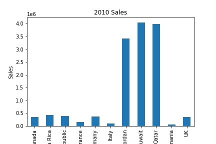
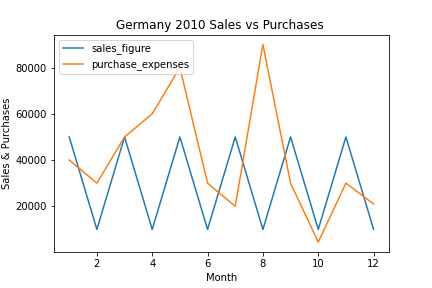

# Sales Figures over all Regions

## Sales for the Year 2010, across all countries

----

## Sales for the Year 2010, across each region

### Europe

### Middle East

### North America

----

## Purchase vs Sales for 2010

## Line Graphs

### Germany

### Romania

## Bar Graphs

### Germany

### Romania

----

## Sum Total for Sales in all Countries

----

## Sum Total for Sales per Region
### (county with highest sales highlighted)

### Europe

### North America

### Middle East

